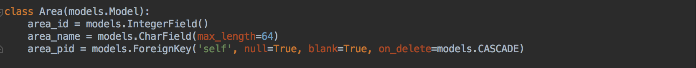

# Django_2.1.8 模型操作数据库

### 通过模型操作数据库

* **>通过模型操作数据，在终端通过 tail -f 查看mysql的实时log，了解Django中通过模型操作数据时mysql的工作方式，以及常见的模型操作语法。**

  * **get**：Class.objects.get(条件)

    > <span style='color:purple'>eg: User.objects.get(id=1) => SQL: SELECT * FROM user WHERE id = 1;</span>
    >
    > <span style='color:purple'>返回表中满足条件的一条数据，有且仅有一条</span>
    >
    > <span style='color:brown'><u>查询到多条数据：抛出异常MultipleObjectsReturned</u></span>
    >
    > <span style='color:brown'><u>查询不到数据：抛出异常DoesNotExist</u></span>

  * **all**：Class.objects.all()

    > <span style='color:purple'>eg: User.objects.all() => SQL: SELECT * FROM user;</span>
    >
    > <span style='color:purple'>返回表中的所有数据</span>
    >
    > <span style='color:brown'>查询结果集合，查询集</span>

  * **filter**：Class.objects.filter(条件)

    > <span style='color:purple'>eg: User.objects.filter(user_gender=0) => SQL: SELECT * FROM user WHERE user_gender=0;</span>
    >
    > <span style='color:purple'>返回表中满足条件的数据，一条或多条</span>
    >
    > <span style='color:brown'>查询结果集合，查询集</span>

  * **exclude**：Class.objects.exclude(条件)

    > <span style='color:purple'>eg: User.objects.exclude(id=1) => SQL: SELECT * FROM user WHERE id != 1</span>
    >
    > <span style='color:purple'>返回表中满足条件之外的其他数据，即不满足条件的数据</span>
    >
    > <span style='color:brown'>查询结果集合，查询集</span>

  * **order by**：Class.objects.filter(条件).order_by(\[-升序，降序][字段1, 字段2,….])

    > <span style='color:purple'>eg: Good.objects.filter(good_create_date__year=2019).order_by('id') => SQL: SELECT * FROM good WHERE good_create_date BETWEEN '2019-01-01' AND '2019-12-31' ORDER BY id;</span>
    >
    > <span style='color:purple'>eg: Good.objects.filter(good_create_date__year=date(2019, 1, 1)).order_by('-id') => SQL: SELECT * FROM good WHERE good_create_date > '2019-01-01' ORDER BY id DESC;</span>
    >
    > <span style='color:green'>**<u>注意DESC的语法</u>**</span>
    >
    > <span style='color:brown'>order_by 也可以直接使用</span>
    >
    > <span style='color:purple'>eg: Good.objects.order_by(good_create_date__year=date(2019, 1, 1)).order_by('-id') => SQL: SELECT * FROM good WHERE good_create_date > '2019-01-01' ORDER BY id DESC;</span>

  

* **>查询条件支持的语法类型**

  ​	条件语法格式：<span style='color:red'>**模型字段名__条件=值**</span>

  * **判等条件：exact**  

    > <span style='color:purple'>eg: User.objects.filter(user_gender__exact=1) => SQL: SELECT * FROM user WHERE user_gender=1;</span> 

  * **模糊查询：contains, startswith, endswith**

    > <span style='color:purple'>eg: User.objects.filter(user_name__contains='小') => SQL: SELECT * FROM user WHERE user_name like '%小%';</span>
    >
    > <span style='color:purple'>eg: User.objects.filter(user_name__startswith='小') => SQL: SELECT * FROM user WHERE user_name like '小%';</span>
    >
    > <span style='color:purple'>eg: User.objects.filter(user_name__endswith='王') => SQL: SELECT * FROM user WHERE user_name like '%王';</span>

  * **空查询：isnull**

    > <span style='color:purple'>eg: User.objects.filter(user_addr__isnull=False) => SQL: SELECT * FROM user WHERE user_addr is not null;</span>
    >
    > <span style='color:purple'>eg: User.objects.filter(user_addr__isnull=True) => SQL: SELECT * FROM user WHERE user_addr is null;</span>

  * **范围查询：in**

    > <span style='color:purple'>eg: User.objects.filter(user_name__in=['小王', '小李', '小红']) => SQL: SELECT * FROM user WHERE user_name IN ('小王', '小李', '小红');</span>

  * **比较查询：gt(greate than), lt(less than), gte(greate than equal), lte(less than equal)**

    > <span style='color:purple'>eg: User.objects.filter(id*__*gt=1,id__lte=8) => SQL: SELECT * FROM user WHERE id > 1 AND id <= 8;</span>

  * **日期查询：year, month, day 以及 gt, lt, gte, lte**

    ><span style='color:purple'>eg: Good.objects.filter(good_create_date__year=2019) => SQL: SELECT * FROM good WHERE good_create_date between '2019-01-01' and '2019-12-31';</span>
    >
    ><span style='color:purple'>eg: Good.objects.filter(good_create_date__gt=date(2019, 1, 1)) => SQL: SELECT * FROM good WHERE good_create_date > '2019-01-01';</span>

    <span style='color:red'>**注意：DateField 支持 year, month, day，DateTimeField仅支持year**</span>

    

* **>查询条件的逻辑操作**

  * **Q**：通过Q可以对查询条件做 **& | ~** 的操作(and or not)

    > **Q**类的导入

    ```python
    from django.db.models import Q
    ```

    > & | ~ 应用

    * 与 , & => AND

      > <span style='color:purple'>eg: Good.objects.filter(good_user=u, good_name='笔记本') => SQL: SELECT * FROM good WHERE good_user_id=1 AND good_name='笔记本';</span>
      >
      > <span style='color:purple'>eg: Good.objects.filter(Q(good_user=u) & Q(good_name='电脑'))</span>

    * 或 | => OR

      > <span style='color:purple'>eg: Good.objects.filter(Q(good_name='笔记本') | Q(good_name='电脑')) => SQL: SELECT * FROM good WHERE good_name='笔记本' OR good_name='电脑';</span>

    * 非  ~ => NOT

      > <span style='color:purple'>eg: Good.objects.filter(~Q(good_name='电脑')) => SQL: SELECT * FROM good WHERE NOT good_name = '电脑'</span>

  

  * **F**：通过F可以对类属性作**比较**操作

    > **F**类导入

    ```python
    from django.db.models import F
    ```

    > **F**类应用

    > <span style='color:purple'>eg: Good.objects.filter(good_user__gt=F('id')) => SQL: SELECT * FROM good WHERE good_user_id > id;</span>

  

* **>聚合操作**

  * Django中使用 **aggregate** 进行聚合操作，返回值为 <span style='color:red'>**字典**</span>

    > 聚合类导入

    ```python
    from django.db.models import Sum, Count, Max, Min, Avg
    ```

    > 聚合类应用

    > <span style='color:purple'>eg: User.objects.all().aggregate(Count('user_name')) => SQL: SELECT COUNT(user_name) FROM user;</span>
    >
    > <span style='color:purple'>eg: User.objects.aggregate(Count('user_name'))</span> # .all()可以省略
    >
    > <span style='color:brown'>返回结果：{'user_name__count': 3}</span>
    >
    > <span style='color:red'>注意：Count()参数不能为''*''</span>

    

  * count()的使用，与聚合中的Count()区分

    * count()是一个函数，用来返回查询结果的数量，返回值为数值

      > <span style='color:purple'>eg: User.objects.all().count() => SQL: SELECT COUNT(*) AS __count FROM user;</span>
      >
      > <span style='color:purple'>eg: User.objects.count()</span> # .all()可以省略
      >
      > <span style='color:brown'>返回结果：3</span>


* **>查询集** django.db.models.query.QuerySet

  使用all(), filter(), exclude()查询操作时，返回结果为QuerySet即查询集。QuerySet有两个特点：

  * **惰性查询**：查询动作发生在使用查询结果时，即只有在真正用到查询结果时，才会去数据库查询数据

    ```python
    goods = Good.objects.all()
    [good for good in goods]
    ```

    只有在执行第二行代码时，才会发生去数据库查询数据的操作

  * **缓存**：查询结果会自动缓存，当再次使用查询结果时，会直接使用缓存数据

    ```python
    goods = Good.objects.all()
    [good for good in goods]
    [good for good in goods]
    ```

    执行第三行代码时，不会再次去数据库查询数据，而是直接使用**缓存**中的数据

  * **exists**：判断查询集是否有数据

    ```python
    goods.exists()
    ```

    有数据返回True, 否则返回False

    

 * **>查询集切片**

   对一个查询集可以使用**取下标或者切片**操作，不能使用负数切片

   * 切片：对一个查询集进行切片操作，会产生一个新的查询集

     ```python
     goods = Good.objects.all()
     g1 = goods[0:1]
     type(g1)
     ```

     type(g1) => <class 'django.db.models.query.QuerySet'>

     通过切片的方式获取第一条数据

     ```python
     goods[0:1]get()
     ```

     > <span style='color:fuchsia'>如果数据不存在，则抛出异常DoesNotExist</span>

   * 取下标：下标不允许为负数

     ```python
     goods[0]
     ```

     > <span style='color:fuchsia'>如果数据不存在，则抛出异常IndexError</span>

### 模型关系

​	<span style='color:navy'>**关联查询**</span>

 * 一对多

   > <span style='color:deeppink'>models.ForeignKey()</span>

   > 关联查询
   >
   > <span style='color:darkcyan'>eg: Good.objects.filter(good_user*__*id__gt=3) => SQL: SELECT * FROM good INNER JOIN user ON good.good_user_id = user.id WHERE user.id > 3</span>
   >
   > <span style='color:darkcyan'>eg: Good.objects.filter(good_user*__*user_name__contains='李') => SQL: SELECT * FROM good INNER JOIN user ON good.good_user_id = user.id WHERE user.user_name LIKE BINARY '%李%'</span>
   >
   > <span style='color:darkcyan'>**双下划线用来做跨表查询操作**</span>

 * 多对多

   > <span style='color:deeppink'>models.ManyToManyField()</span>
   >
   > 定义在哪个类中都可以

 * 一对一

   > <span style='color:deeppink'>models.OneToOneField()</span>
   >
   > 定义在哪个类中都可以

    **注意：通过模型类进行关联查询时，要查哪个表中的数据就用哪个类来查**
   
   <span style='color:navy'>**插入和删除**</span>
   
* 插入

  > u = User()
  >
  > u.xx = xx
  >
  > ..
  >
  > u.xx = xx
  >
  > u.save() => SQL: INSERT INTO user (user_name, user_gender, user_addr) VALUES ('xx', 1, 'xx');

* 删除

  > u = User.objects.get(id=1)
  >
  > u.delete() => SQL: DELETE FROM user WHERE id in (1)

  <span style='color:navy'>**自关联**</span>

  自关联本质上还是**一对多**的模型，自关联仍旧采用ForeignKey

  

   

  

  

  
  
  一对多查询：通过一类.多类_set
  
  > User.objects.get(user_name__contains='小').good_set.all()
  
  多对一查询：通过多类.属性可以获取到一类及其属性(__一类属性)
  
  > Good.objects.filter(good_user*__*user_name__contains='小王')


* 一对多查询示例

  User => 多个Good

  一对多查询
  
  ```python
  
  ```
# 查询用户信息，要求用户关联的商品名称包含'Intel'
  User.objects.filter(good__good_name__contains='Intel')
  # SQL
  SELECT * FROM user INNER JOIN good ON user.id = good.good_user_id WHERE good.good_name LIKE '%Intel%';
  ```
  
  多对一查询
  
  ```python
  # 查询用户名为'小李'的所有商品
  Good.objects.filter(good_user__user_name='小王')
  # SQL
  SELECT * FROM good INNER JOIN user ON good.good_user_id = user.id WHERE user.user_name = '小王';
  ```

  

  * **通过模型类实现关联查询时，要查哪个表中的数据，就需要用哪个表来查**
  
  * **关联查询时，如果类中没有关系属性，条件可以通过对应的类名即可，如果有关系属性，直接通过关系属性查询**
  
  * **跨表查询通过双下划线实现**
