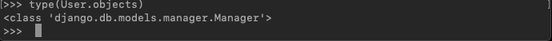
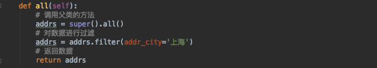
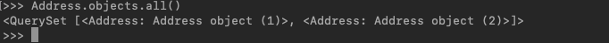
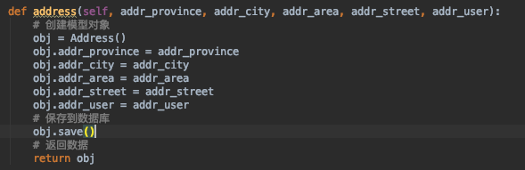
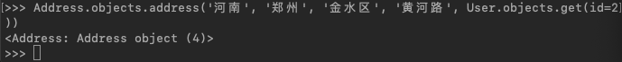
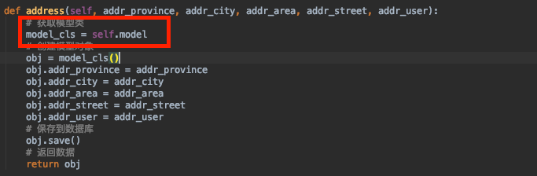
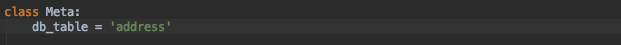
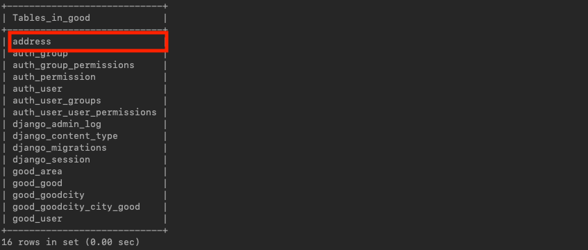

# Django_2.1.8_Models_Manager

> <span style='color:darkcyan'>模型管理类介绍</span>

* Django中的每一个模型类都是一个模型管理类对象

  

  django.db.models.manager.Manager类，是Django中提供的一个模型管理类，可以自定义模型管理类

> <span style='color:darkcyan'>自定义模型管理类</span>

* 创建模型管理类

  ```python
  class AddressManager(models.Manager):
    pass
  ```

* 在模型类中定义一个模型管理类对象

  

> <span style='color:darkcyan'>自定义模型管理类应用</span>

* 改变查询的结果集

  



* 封装函数，操作模型类对应的数据表(增删改查)

  在Django中模型类和表一一对应，有时需要给模型类添加一些自定义方法，为了保持代码的可读性，可以把自定义方法封装放在模型管理类中





* 通过模型管理类获取模型类

  ```python
  model_cls = self.model
  ```

  例如上述方法可以改为



> <span style='color:darkcyan'>使用元选项指定模型类对应的表名</span>

* Django默认生成的表名：应用名小写_模型类名小写

  可以在模型类中定义一个元类Meta,通过其db_table指定其表名



​		注意：上述格式是固定的

​		指定表名之后，需要重新数据迁移


