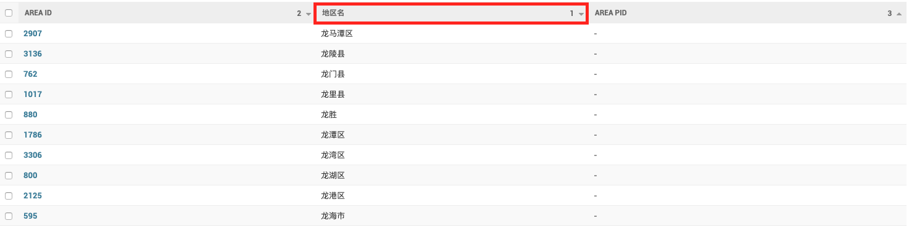
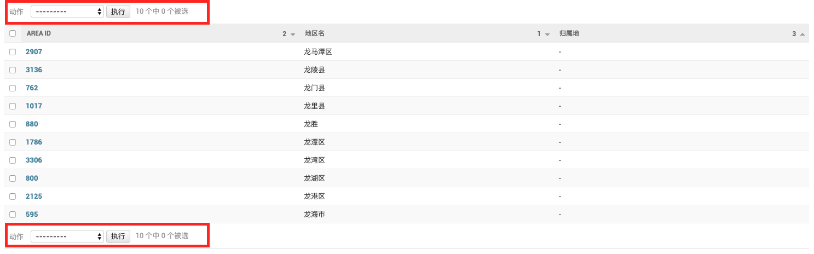
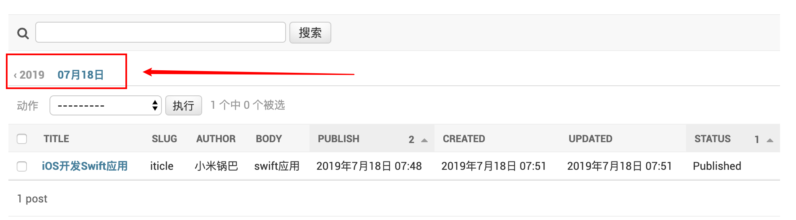
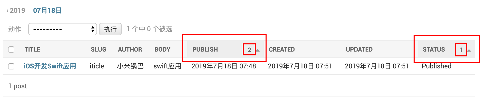
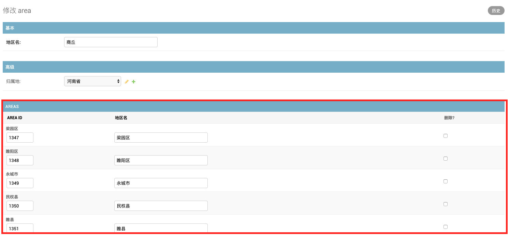
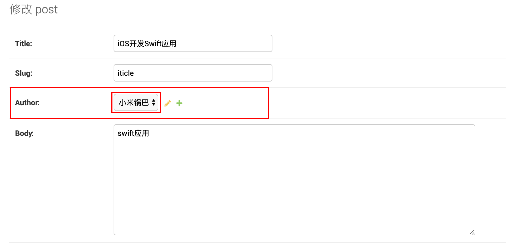
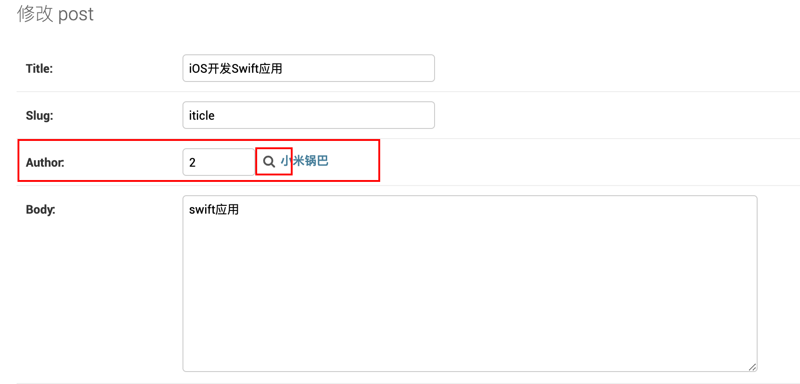
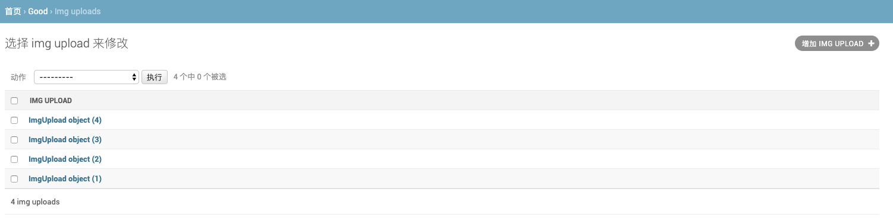

<div style="width:100%;height:30px;"><div style='float:right;'>- 2019.06.Django -</div></div>
<div style="float:left;width:12.5%;height:4px;background:deeppink;"></div>
<div style="float:left;width:12.5%;height:4px;background:fuchsia;"></div>
<div style="float:left;width:12.5%;height:4px;background:maroon;"></div>
<div style="float:left;width:12.5%;height:4px;background:navy;"></div>
<div style="float:left;width:12.5%;height:4px;background:crimson;"></div>
<div style="float:left;width:12.5%;height:4px;background:darkcyan;"></div>
<div style="float:left;width:12.5%;height:4px;background:purple;"></div>
<div style="float:left;width:12.5%;height:4px;background:brown;"></div>

## Django_2.1.8_more

* 静态文件

  **动态获取静态文件路径**

  * 在模板中引入staticfiles

    ```python
    
    ```

  * 在模板中使用静态文件

    ```python
    
    ```

* 中间件

  中间件即Django给开发人员预留的函数接口，中间件需要在MIDDLEWARE中注册以后使用，由于中间件可能存在相互依赖的情况，所以中间件的注册需要考虑顺序，中间的使用，以屏蔽特殊IP访问为例：

  在不使用中间件时：

  * 获取客户端的ip的方式

    ```python
    request.META['REMOTE_ADDR']
    ```

  * 实现一个装饰器

    ```python
    def blocked_ip(fun):
        """IP 黑名单"""
        def wrapper(request, *args, **kwargs):
            remote_ip = request.META['REMOTE_ADDR']
            if remote_ip in BLOCKED_IPS:
                return HttpResponse('403 FORBIDDEN')
            else:
                return fun(request, *args, **kwargs)
        return wrapper
    ```

    在views中的函数中使用装饰器，可以禁止对单个页面的访问，但是如果要实现对特定IP全网禁止访问，就比较麻烦，所以要用到中间件。

  * 利用中间件实现IP黑名单

    创建中间件文件middleware.py

    ```python
    from django.http import HttpResponse
    
    # 中间件
    
    class BlockedIPSMiddleware(object):
    
        BLOCKED_IPS = ['192.168.2.106']
    
        def __init__(self, get_response):
            self.get_response = get_response
    
        def __call__(self, request):
            response = self.get_response(request)
            return response
    
        def process_view(self, request, *view_args, **view_kwargs):
            """视图函数调用之前会调用该中间件接口"""
            remote_ip = request.META['REMOTE_ADDR']
            if remote_ip in BlockedIPSMiddleware.BLOCKED_IPS:
                return HttpResponse('<h1>403 Forbidden</h1>')
    ```

    在文件中创建中间件类，并实现*__*init*__*和*__*call*__*方法，```process_view```方法为视图函数调用之前，django会自动调用的中间件接口

    在project中的settings中的MIDDLEWARE中注册新建的中间件

    ```python
    'iticle.middleware.BlockedIPSMiddleware',
    ```

    当被列入BLOCKED_IPS中的IP再次访问网站时就会被禁止访问。

  * **常用中间件函数**

    * *__*init*__*: 服务器响应第一个请求的时候调用

    * *__*call*__*:每次响应请求都调用的方法

    * process_request: 是在产生request对象，进行url匹配之前调用

    * process_view：是url匹配之后，调用视图函数之前

    * process_resposne:视图函数调用之后，内容返回给浏览器之前

    * Process_exception:视图函数出现异常，会调用这个函数

      **如果注册的多个中间件类中包含process_exception函数的时候，调用的顺序跟注册的顺序是相反的**，言外之意就是，如果中间件函数存在重复定义的情况，那么<span style='color:red'>**后注册的中间件函数将覆盖之前注册的中间件函数**</span>

  * **中间件调用顺序**

    > 浏览器发起请求到达django
    >
    > 在Django产生request对象
    >
    > 调用中间件中的**process_request**
    >
    > 根据url配置，进行url匹配
    >
    > 调用中间件中的**process_view**
    >
    > 调用view
    >
    > 调用中间件类中的**process_response**
    >
    > 返回数据给浏览器

* Admin后台管理

  * 分页，只需要在后台管理类中设置分页中每页显示数量即可

    ```python
    # 设置分页中每页显示数量
    list_per_page = 10
    ```

  * 后台显示字段排序

    * 如果list_display中使用的是model中的字段，则默认可以直接进行排序

    * 如果list_display中使用的是model中的方法，则需要自己设置排序字段```admin_order_field```,值为需要排序的字段

      **models.py**

      ```python
      def area_cn_name(self):
        return self.area_name
      area_cn_name.admin_order_field = 'area_name'
      ```

      **admin.py**

      ```python
      # 设置后台显示内容
      list_display = ['area_id', 'area_cn_name', 'area_pid']
      ```

  * 获取关联对象的属性

    ```python
    def parent(self):
      if self.area_pid is None:
        return ''
      else:
        return self.area_pid.area_name
    ```

  * 指定**方法对应列**的标题（这里指的是通过调用models中的方法显示在后台中的列）

    ```python
    def area_cn_name(self):
      return self.area_name
    area_cn_name.admin_order_field = 'area_name'
    area_cn_name.short_description = '地区名'
    ```

    

  * 指定后台默认显示的列标题

    在models中指定属性的verbose_name即可

    ```python
    area_name = models.CharField(max_length=64, verbose_name='地区名')
    ```

  * 设置筛选执行栏的位置，在admin中可以设置用来筛选和执行任务栏的位置，可以选择开启或者关闭

    ```python
    actions_on_top = False
    actions_on_bottom = True
    ```

    

  * 设置右侧过滤栏

    ```python
    list_filter = ['area_id', 'area_name']
    ```

  * 设置顶部搜索栏

    ```python
    # 设置列表页上方的搜索框
    search_fields = ['area_name', 'area_id']
    ```

    <span style='color:purple'>**+1>>**：添加日期导航```date_hierarchy = 'publish'```</span>

    

    <span style='color:purple'>**+1>>**：设置排序规则```ordering = ('status', 'publish')```， 排序按照字段先后</span>

    

* 编辑状态

  * 字段显示顺序

    ```python
    # 指定管理后天模型类详情显示循序
    fields = ['area_id', 'area_pid', 'area_name']
    ```

  * 给字段分组

    ```python
    fieldsets = (
            ('基本', {'fields': ['area_name']}),
            ('高级', {'fields': ['area_pid']}),
    )
    ```

  **注意：fields 和 fieldsets 不能同时设置**

  * 在一对多关系中，Django提供了在一端编辑多端数据的方式，即在一端的编辑页面嵌入**表格**或者**块**两种方式。

    * 表格：TabularInline

    * 块：StackedInline

    * TabularInline 和 StackedInline 都是 InlineModelAdmin的子类，用来表示在模型的编辑页面嵌入相关模型的编辑

    * TabularInline

      ```python
      class AreaAdminTabularInline(admin.TabularInline):
          """一端的编辑页面嵌入多端的对象，表格方式"""
          # 指定关联模型
          model = Area
          # 设置用来添加多端对象的空白编辑区数量
          extra = 1
      ```

    * StackedInline

      ```python
      class AreaAdminStackedInline(admin.StackedInline):
          """一端的编辑页面嵌入多端的对象，块方式"""
          # 指定关联模型
          model = Area
          # 设置用来添加多端对象的空白编辑区数量
          extra = 1
      ```

    * 在admin中的管理模型中，设置inlines

      ```python
      inlines = [AreaAdminStackedInline]
      或
      inlines = [AreaAdminTabularInline]
      ```

      

  * 自定义后台页面

    在templates文件夹中创建admin子文件夹，并从```~/.virtualenvs/django_2.1.8/lib/python3.7/site-packages/django/contrib/admin/templates/admin/```拷贝base_site.html到admin文件夹中，那么再次打开admin的时候，django就会优先使用自定义的后台模板

    一般如果需要使用高度自定义的后台模板，会选择其他第三方的模板作为一个app嵌入到django中，而不选择重定义django模板的方式

  <span style='color:purple'>**+1>>**：预填充字段内容，可通过prepopulated_fields属性指定，```prepopulated_fields = {'slug': ('title',)}```，即根据title输入预填充slug字段的内容</span>

  <span style='color:purple'>**+1>>**：对外键关联对象使用查找功能，通过raw_id_fields属性指定，```raw_id_fields = ('author',)```，即替换默认的下拉选择方式，在大数据量查找时比较有效</span>

  替换前（下拉选择方式）

  

  替换后（查找选择方式）

  

* 图片上传

  **后台上传图片**

  * 在settings中配置上传文件保存目录(存放上传图片的目录可放在static中也可以单独创建，media文件夹中还可以分类创建不同的文件夹)

    ```python
    MEDIA_ROOT = os.path.join(BASE_DIR, 'static/media')
    ```

  * 在models中创建文件上传类，注意upload_to为上传到的文件夹，相对于media的路径，ImageField可以对上传的文件类型进行校验，即上传的文件必须是图片。

    ```python
    class ImageUpload(models.Model):
      """图片上传类"""
      # upload_to 是图片需要上传的目录
      img = models.ImageField(upload_to='iticle')
    ```

  * 在后台上传时，注册图片上传类

    ```python
    admin.site.register(ImgUpload)
    ```

    

  **前端页面上传图片**

  * 前端需要通过表单提交

    ```python
    
    表单上传图片
    * 方法必须为post
    * 需要指定enctype为multipart/formm-data
    * 需要在模板中添加csrf_token用来做csrf认证
    
    <form action="/upload_img_action" method="post" enctype="multipart/form-data">
    
        
    
        <input type="file" name="img" /><br />
        <input type="submit" value="上传图片" />
    
    </form>
    ```

  * 上传图片类型request.FILES['img']

    ```python
    <class 'django.core.files.uploadedfile.InMemoryUploadedFile'>
    ```

    ```python
    <class 'django.core.files.uploadedfile.TemporaryUploadedFile'>
    ```

    InMemoryUploadedFile和TemporaryUploadedFile都是UploadedFile的子类

    **上传文件不大于2.5M的情况，那么上传的文件内容会存储在内存中，返回的文件数据类型为InMemoryUploadedFile，否则会将文件内容写入临时文件，返回数据类型为TemporaryUploadedFile。从内存中读取文件会比从临时文件中读取速度快，但是在上传大图片时需要减少内存开销，所以会使用临时文件存储图片内容**

  * 接受图片上传请求

    ```python
    def upload_img_action(request):
        """upload img action"""
        # 1.获取上传的图片
        img = request.FILES['img']
        # img.name可以获取到图片的名字
        img_name = img.name
        # 2.创建一个文件
        upload_path = '%s/iticle/%s' % (settings.MEDIA_ROOT, img_name)
        with open(upload_path, 'wb') as image:
            for content in img.chunks():
              	# chunks()用来不断读取图片你的内容
                # 3.获取上传图片的内容并写到新建的文件中
                image.write(content)
    
        # 4.在数据库中保存上传记录
        ImgUpload.objects.create(img='iticle/%s' % img_name)
    
        # 5.返回结果
        return HttpResponse('OK')
    ```

    [了解更多关于图片上传](https://docs.djangoproject.com/zh-hans/2.2/topics/http/file-uploads/)

* 分页

  使用Django中的分页，需要导入Paginator

  ```python
  from django.core.paginator import Paginator
  ```

  > 获取到所有的数据后，创建Paginator实例对象，并设置每页显示数量
  >
  > ```python
  > paginator = Paginator(areas, 10)
  > ```
  >
  > 获取第n页的对象，生成一个Page实例对象
  >
  > ```python
  > page = paginator.page(page_index)
  > ```

  分页中最重要也是最常用的两个类分别为Paginator和Page

  * Pagintor

    * count 所有页面总的对象数量
    * num_pages 获取总页数

    * page_range 分页后的页码表
    * page(self, number) 返回第number页的Page实例对象

  * Page

    * number 当前页码
    * object_list 当前页包含的数据
    * paginator 由Page实例对象可以获取对应的Paginator实例

    * has_previous() 判断当前页是否还有前一页
    * has_next() 判断当前页是否还有后一页
    * has_other_pages() 判断是否存在上一页或者下一页，存在返回true
    * previous_page_number() 返回前一页的页码
    * next_page_number() 返回后一页的页码
    * start_index() 当前分页页面上的起始索引，从1开始
    * end_index() 当前分页页面上的结束索引

* ajax应用

  * 使用jquery中的ajax，需要先导入jquery

    ```python
    <script src="/static/js/jquery-1.12.4.min.js"></script>
    ```

  * 发起ajax请求

    ```js
    $.ajax({
      'url': '/user/login_ajax_handle',
      'type': 'post',
      'dataType': 'json',
      'data': {'username': username, 'password': password, 'keep_user_name': keep_user_name, 'verify_code': verify_code}
    }).success(function (data) {
      // 处理返回结果
    })
    ```

  * jquery中封装的get

    ```javascript
    $.get('/ajax_query_pca/' + pid, function (data) {
      let areas = data.result
      // 遍历结果
      $.each(areas, function (index, item) {
        let area_id = item[0]
        let area_name = item[1]
        let option = '<option value="' + area_id + '">' + area_name + "<option />"
        select.append(option)
      })
    })
    ```

  * jquery中封装的post

    ```javascript
    $.post('url', {'a': b}, function (data) {
      // 处理请求结果
    })
    ```

  * 两种遍历数据的方式

    ```javascript
    // 方式一
    for (let i = 0; i < provinces.length; i++) {
      let pro = provinces[i]
      let area_id = pro[0]
      let area_name = pro[1]
      let option = '<option value="' + area_id + '">' + area_name + '</option>'
      pro_select.append(option)
    }
    
    // 方式二
    $.each(provinces, function (index, item) {
      let area_id = item[0]
      let area_name = item[1]
      let option = '<option value="' + area_id + '">' + area_name + '</option>'
      pro_select.append(option)
    })
    ```

  * ajax操作select

    ```javascript
    // 根据id获取select
    let pro_select = $('#province_id')
    // 清空select的option
    pro_select.empty()
    // 给select添加option
    pro_select.append('option1')
    // select发生改变
    pro_select.change(function() {
      // 获取改变后的结果
      let pro_id = $(this).val()
    })
    ```


* 表删除后重建

  * 在django_migrations表中删除对应的创建model的记录
  * 在工程的migtations中删除对应的生成文件，并把下一个生成文件的记录修改为上一个生成记录
  * makemigrations + migrate

  * 如果提示表已存在，则可以利用```python3 manage.py migrate good --fake```命令

* 在带有**外键**的model生成的表，从sql文件导入数据时可能会遇到报错<span style='color:red'>**a foreign key constraint fails**</span>

  ```sql
  Cannot add or update a child row: a foreign key constraint fails (`good`.`#sql-282_1d5`, CONSTRAINT `rc_district_ibfk_1` FOREIGN KEY (`district_id`) REFERENCES `rc_district` (`pid`))
  mysql> alter table rc_district add foreign key (pid) references rc_district(district_id);
  ```

  这是由于在导入数据时默认是开启外键检查的，关闭后再导入数据即可

  ```sql
  SET FOREIGN_KEY_CHECKS=0;
  ```

  导入数据后再打开外键检查

  ```sql
  SET FOREIGN_KEY_CHECKS=1;
  ```

### 关于email

* 在Django中内置了邮件相关的库

  ```python
  from django.core.mail import send_mail
  send_mail(subject, message, sender, receiver)
  ```

  ```python
  # 验证链接
  email_check_url = 'http://127.0.0.1:8000/user/active/%s' % token
  
  # 发送邮件
  subject = 'TTSX EMAIL CHECK'
  message = ''
  sender = settings.EMAIL_FROM
  receiver = [email]
  # 包含html标签的信息
  html_message = '<h1>欢迎注册TTSX!</h1><br />请点击链接验证：' + '<a href="%s">%s</a>'%(email_check_url, email_check_url)
  send_mail(subject, message, sender, receiver, html_message=html_message)
  ```

  <span style='color:red'>注意：send_mail是**阻塞执行**的，会影响后续代码执行</span>

* 采用celery发送邮件

  关于celery及其应用，具体请参考【Celery及其应用.md】


> <span style='color:fuchsia'>fuchsia</span>
>
> <span style='color:maroon'>maroon</span>
>
> <span style='color:navy'>navy</span>
>
> <span style='color:crimson'>crimson</span>
>
> <span style='color:deeppink'>deeppink</span>
>
> <span style='color:darkcyan'>darkcyan</span>

<div style="width:100%;height:30px;"><div style='float:right;'>- 2019.06.Django -</div></div>
<div style="float:left;width:12.5%;height:4px;background:deeppink;"></div>
<div style="float:left;width:12.5%;height:4px;background:fuchsia;"></div>
<div style="float:left;width:12.5%;height:4px;background:maroon;"></div>
<div style="float:left;width:12.5%;height:4px;background:navy;"></div>
<div style="float:left;width:12.5%;height:4px;background:crimson;"></div>
<div style="float:left;width:12.5%;height:4px;background:darkcyan;"></div>
<div style="float:left;width:12.5%;height:4px;background:purple;"></div>
<div style="float:left;width:12.5%;height:4px;background:brown;"></div>