## Django

* Django简介 从MVC演变的MVT

类型 | Model | 视图 | 控制器
:-: | :-: | :-: | :-:
MVC | M | V | C
MVT | M | T | V

* 为了解决不同项目不同的版本依赖，在python实际开发中使用虚拟环境创建项目依赖

* 虚拟环境安装

  ```shell
  <!--安装virtualenv虚拟环境-->
  pip3 install virtualenv
  <!--安装virtualenvwrapper扩展包-->
  pip3 install virtualenvwrapper
  ```

  ```shell
  将virtualenv 和 virtualenvwrapper的启动命令添加到shell启动文件
  cd ~/
  vim .bashrc
  添加启动命令
  
  export WORKON_HOME=$HOME/.virtualenvs
  export PROJECT_HOME=$HOME/Desktop/virtualenvs
  # 在python版本不一致时，会导致报错，python中找不到virtualenvwrapper包，添加python路径解决
  VIRTUALENVWRAPPER_PYTHON=/usr/local/bin/python3
  source /usr/local/bin/virtualenvwrapper.sh
  
  生效shell文件命令
  source .bashrc
  ```

* 使用虚拟环境创建命令

  ```shel
  指定python3创建 -p python版本 项目名
  mkvirtualenv -p python3 django_demo
  ```

  创建成功后，命令行会自动进入新创建的虚拟环境
  
  
  
  创建的虚拟环境即真实python环境的虚拟版本，查看虚拟环境目录路径：
  
  ```sh
  cd ~/.virtualenvs/
  ```
  
  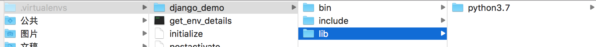
  
  如果在虚拟环境中安装python包也是安装在虚拟环境中。
  
* 退出虚拟环境

  ```sh
  deactivate
  ```

  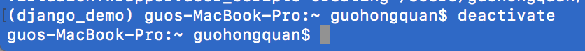

* 进入虚拟环境

  ```sh
  workon django_demo
  ```

  

* 删除虚拟环境

  ```sh
  rmvirtualenv django_demo
  ```

  删除虚拟环境时，需要退出后才能删除。
  
* 使用django创建项目

  ```sh
  进入虚拟目录
  workon django_demo
  创建项目文件夹
  mkdir hello_django
  cd hello_django
  使用django-admin创建一个项目
  django-admin startproject hello_django
  ```

  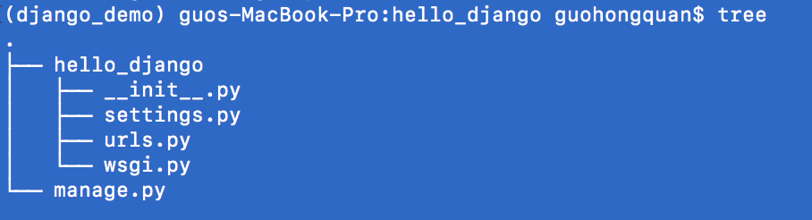

  ***__init***__.py：python中包的初始化文件

  settings.py：项目的配置文件

  urls.py：url路由配置规则

  wsgi.py：web服务和Django交互入口

  manage.py：项目的管理文件

* 项目中每一个功能模块用Django中的一个应用来完成，创建Django项目中的应用

  ```py
  python manager.py startapp 应用名
  ```

  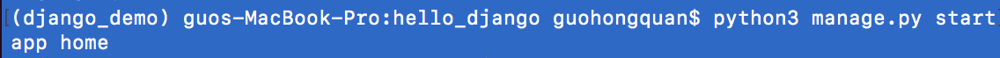

  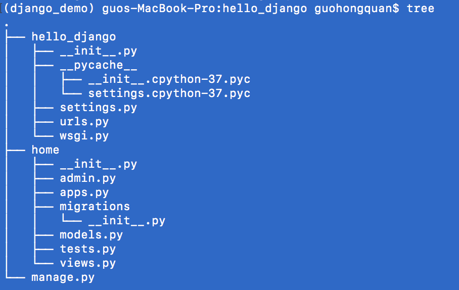

  home目录结构

  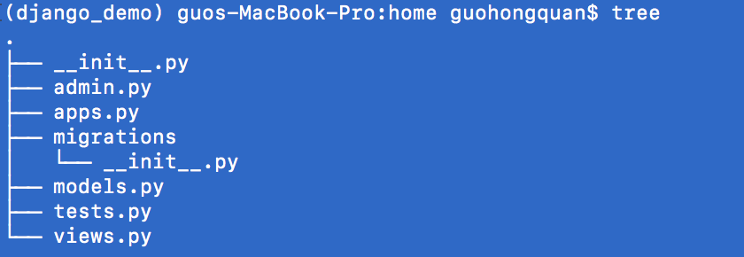

  ***__init***__.py：python包的初始化文件

  admin.py：后台管理相关的文件

  models.py：写跟数据库相关的内容

  tests.py：测试代码

  Views.py：与Model和Template交互，定义处理函数，定义视图函数
  
* 打开项目，并在项目的settings文件中注册创建的app

  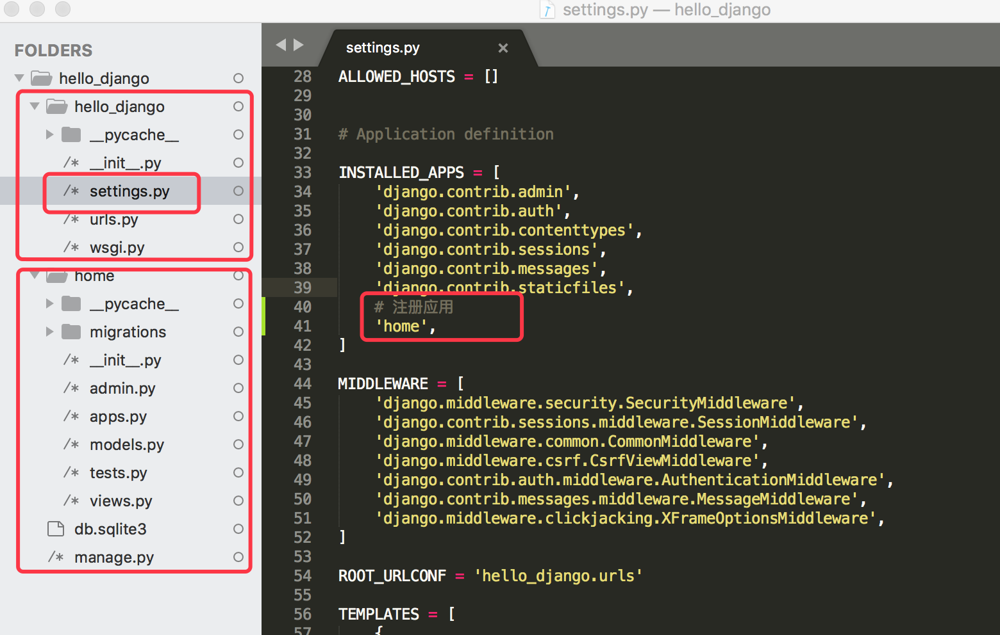

  <span style='color:purple'>**+1>>**：将app注册时，推荐使用Django内置app注册的方式，即```blog.apps.BlogConfig```方式注册</span>

  <span style='color:purple'>**+1>>**：注意，一般在项目中由于app会比较多，会将所有app放在一个python package中（在项目根目录新建python package名为apps,  然后将所有新建app拖入apps中）,此时注册app时，有两种方式：1.'apps.home' 2.在项目的settings中添加搜索路径```sys.path.insert(0, os.path.join(BASE_DIR, 'APPS'))```，相比方式1，方式2更加便捷，因为开发中用到app路径的地方不止一处，为了便于维护，推荐使用方式二进行目录结构整合</span>

* 启动项目

  ```sh
  python3 manage.py runserver
  ```

  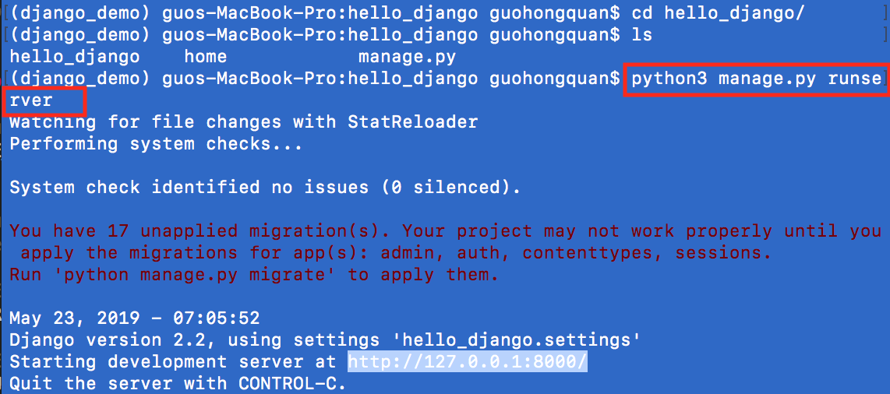

  在浏览器中打开，即可看到创建的项目原型。[localhost](http://127.0.0.1:8000)

  启动服务时允许指定端口号

  ```sh
  python3 manage.py runserver 127.0.0.1:7890
  ```

  后续访问就可以通过指定的端口号访问。

* django中项目的根目录即manage.py文件所在路径

* 在models.py中创建需要的自定义类，在django中会自models.py中的类生成数据库表，其操作分两步：

  * 生成迁移文件

    ```sh
    python3 manage.py makemigrations
    ```

    

    生成的迁移文件内容

    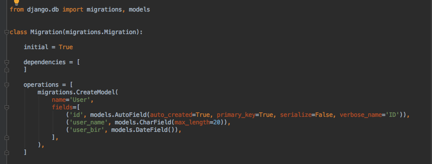

    <span style='color:purple'>**+1>>**：生成迁移文件时，可以单独生成新增的model的迁移，即```python3 manager.py makemigrations blog```</span>

    <span style='color:purple'>**+1>>**：可以通过```python3 manager.py sqlmigrate blog 0001```查看操作数据库的SQL，0001为makemigrations时生成的迁移文件名</span>

  * 执行迁移文件，生成数据库表

    ```sh
    python3 manage.py migrate
    ```

    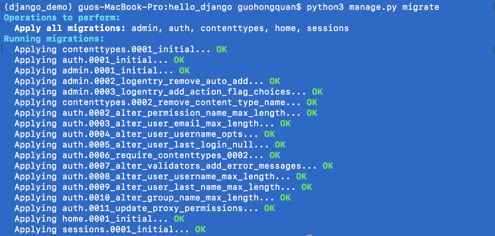

    生成的数据库表名：app名_类名

    <span style='color:purple'>**+1>>**：Django默认使用app名字 + '_' + model类的小写名字</span>

    <span style='color:purple'>**+1>>**：Django中可以不适用自动生成的表名，可以通过在Meta类中使用db_table指定自定义表名</span>
    
    <span style='color:purple'>**+1>>**：Django默认生成id为主键，可以给字段通过primary_key=True指定为主键</span>
    
    <span style='color:purple'>**+1>>**：migrate的作用，'keep the database in sync with your models'</span>
    
    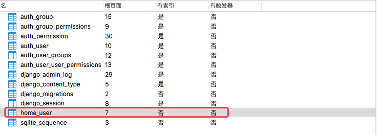
    
    注：django默认数据库sqlite3
    
    

* 通过shell添加数据到数据库

  进入shell命令

  ```sh
  python3 manage.py shell
  ```

  通过类添加数据到数据库，注意save()

  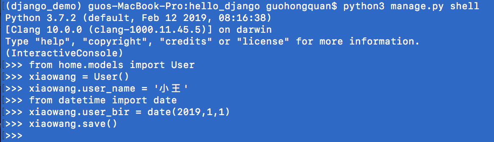

  通过类指定条件查询数据

  ```sh
  类名.objects.get(条件)
  ```

  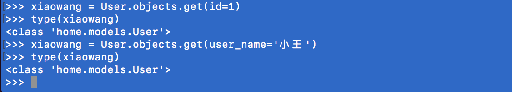

  修改数据

  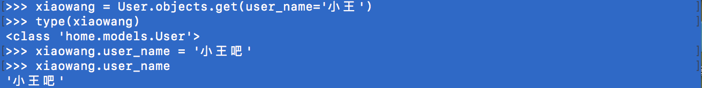

  如果仅做修改，而不save()的话，不会保存到数据库

  

  删除数据表中的数据

  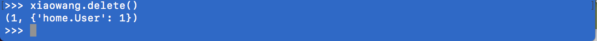
  
  
  
* 关联表

  创建一个商品类Goods

  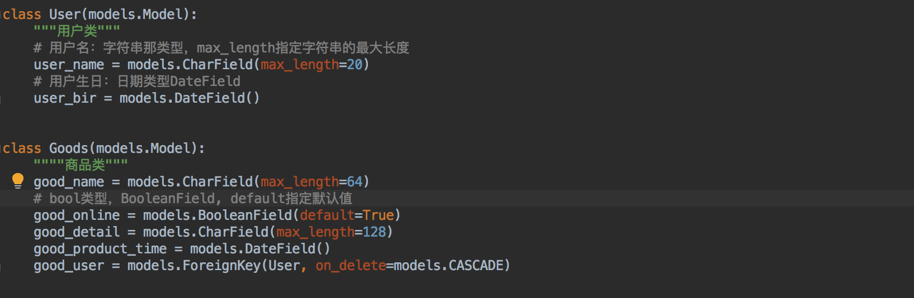

  **<span style='color:red'>Django中模型类的类属性不能使用连续的下划线，这是由于Django的查询方式所决定的。</span>**

  good_user：商品对应的user_id,在Django中使用ForignKey进行外键关联，User即需要关联的数据表，on_delete即是否在删除用户的时候一并删除用户的所有商品，CASCADE即删除(CASCADE与Django无关，为SQL语法)。(注：ForeignKey的用法在Django的不同版本中用法不尽相同需注意使用)。ForeignKey在数据库中的具体呈现方式为，生成一个关联字段，格式：当前类名(小写)_关联类名(小写) _id，例如本例中的good_user_id
  
  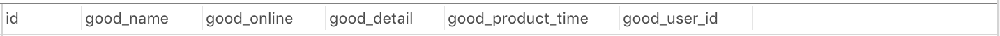
  
  创建对象关联外键
  
  
  
  mac.good_user = xiaoguo，其中xiaoguo为User对象，在创建数据库表时
  
  <span style='color:purple'>**+1>>**：在models中使用外键时，如果要关联的model不在当前app，则关联时要通过app名找对应的model：```user = models.ForeignKey('user.User', verbose_name='用户')```</span>

* 模型类中常用的字段类型说明：

  AutoField：自动增长类型，一般用在id主键，但django会自动为模型类添加id主键

  CharField：文字类型，<span style='color:red'>必须</span>指定max_length参数值，否则报错

  TextField：较长文字类型，一般大于4000

  BooleanField：boolean类型，True 或 False

  NullBooleanField：可为Null的boolean类型，True, False, Null

  IntegerField：Int类型

  FloatField：Float类型

  DecimalField：Decimal类型

  <span style='color:green'>DateField：Date的时间戳</span>

  <span style='color:green'>TimeField：Time的时间戳</span>

  <span style='color:green'>DateTimeField：日期时间时间戳, Date+Time</span>

  <span style='color:purple'>): auto_now:是否自动保存每次更新的时间戳，默认False</span>

  <span style='color:purple'>): auto_now_add:是否自动保存第一次创建时的时间戳，默认False</span>

  FileField：文件类型，文件上传的类型

  ImageField：图片类型，图片上传的类型


​		db_column可以用来指定模型类属性跟表中字段的对应关系

​		**user_name = models.CharField(max_length=128, db_column='username')**


* 字段约束

  default：默认值

  primary_key：主键，默认False,一般作为AutoField的选项使用

  unique：是否唯一，默认False,值为True时该字段值必须唯一

  db_index：为该字段添加索引，默认False

  db_column：为该属性指定一个名字，如果未指定则默认使用属性名

  null：表示是否允许为空，默认False，默认False时，如果该字段为空，则报错  <span style='color:red'>): null，针对的是数据库的范畴</span>

  blank：表示该字段是否允许空白，默认False，默认False时，如果该字段为空，则报错 <span style='color:red'>): blank，针对的是页面表单验证的范畴</span>


​	**<span style='color:red'>注意：如果在开发过程中对模型类的类型有修改，如果修改不影响表结构，不需要对模型类做migrate操作</span>**


* 登录后台

  设置站点语言

  ```python
  LANGUAGE_CODE = 'zh-hans'
  ```

  设置时区

  ```python
  TIME_ZONE = 'Asia/Shanghai'
  ```

  创建管理员

  ```sh
  python3 manage.py createsuperuser
  ```

  启动django服务

  ```sh
  python3 manage.py runserver
  ```

  访问后台页面

  [admin](http://127.0.0.1:8000/admin/)
  
* 注册模型类

  即在admin.py中注册模型类，告诉Django框架，根据模型类创建对应的表管理页面

  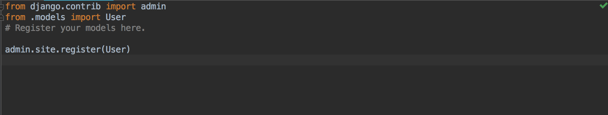

  ```python
  admin.site.register(User)
  ```

  直接注册模型类时，在admin页面只能看到模型类的str(user)结果，没有详细的数据，这时需要我们自定义管理类进行注册

  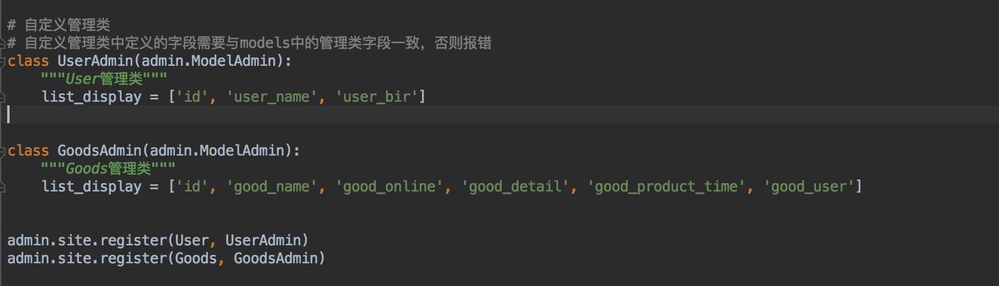

  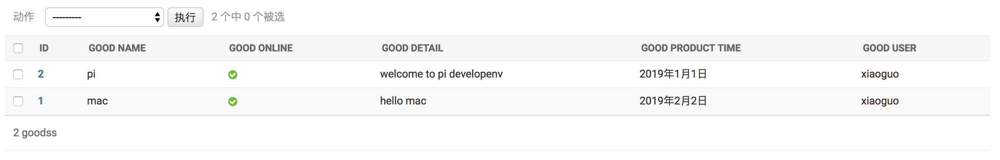
  
  <span style='color:purple'>**+1>>**：自定义admin类注册时，可以使用装饰器```@admin.register(Post)```对Admin类进行装饰注册，效果与```admin.site.register(Post, PostsAdmin)```一样</span>
  
  ```python
  @admin.register(Post)
  class PostsAdmin(admin.ModelAdmin):
      """PostsAdmin Posts"""
      list_display = ['title', 'slug', 'author', 'body', 'publish', 'created', 'updated', 'status']
  ```
  
  <span style='color:fuchsia'>**多对多关系时，注册管理模型类**</span>
  
  需要对多对多关系的字段做遍历操作
  
  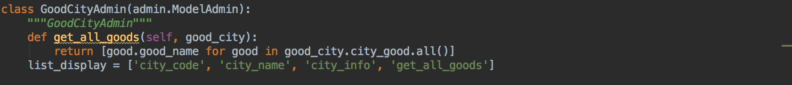
  
  GoodCity => GoodCityAdmin
  
  GoodCity.city_good = models.ManyToManyField('Good')
  
  故在管理类中，需要对good_city.city_good做遍历操作


# View

* 在views.py中，定义视图函数，参数request，返回值为HttpResponse(内容)

  :)注意需要从Django中导入HttpResponse

  ```sh
  from django.http import HttpResponse
  ```

* 设置路由，在urls.py中配置url路由，建立view和url地址的对应关系

  在自定义的app中创建一个urls.py文件，方便后期做路由复用

  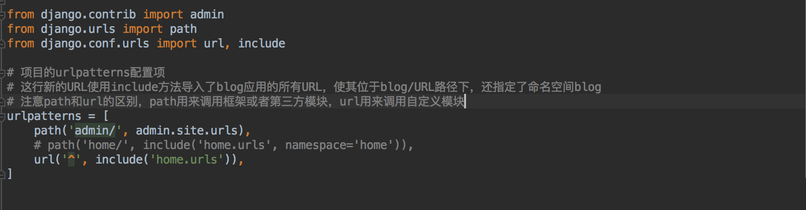

  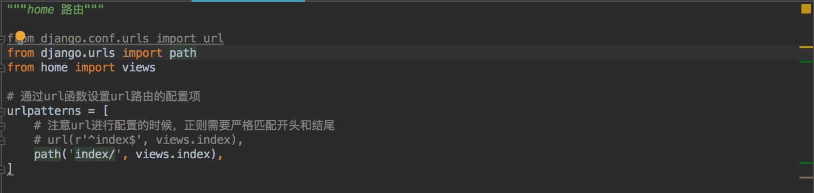

  访问：[index](http://127.0.0.1:8000/index)

# Templates

* 创建一个templates文件夹作为模板的文件路径，templates在项目根目录，templates中可以包含对各个app模块的模板文件夹

  在项目settings文件中，设置模板路径

  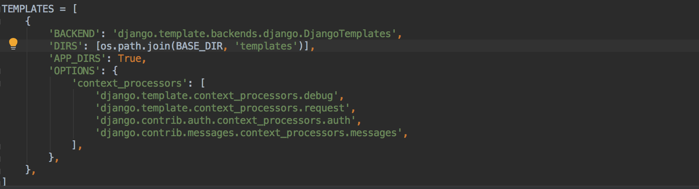

  注：DIRS需要指定绝对路径，即通过BASE_DIR拼接templates文件夹指定

* 在views中定义视图函数，并指定模板，及其参数

  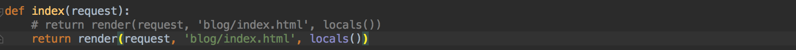

* 页面跳转和传参

  在views中定义视图函数，并设定参数

  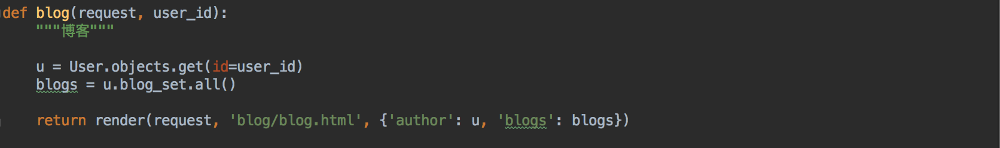

  在模板中设定跳转参数：注意此处的路由规则为自己设置的规则

  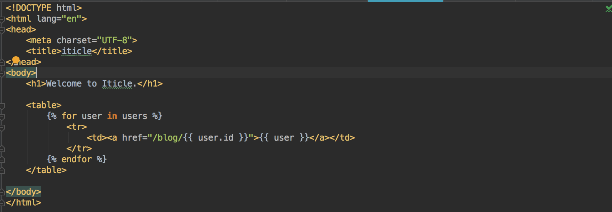

  在路由中设置路由和参数：注意参数需要使用正则的分组方式进行分组后才能正确传递

  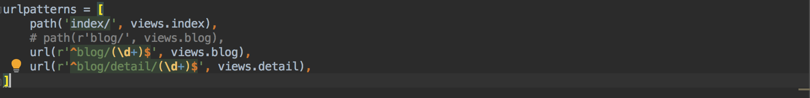

# 数据库选择

* 由于Django目前2.2版本对mysql的驱动支持有问题，故一下Django版本切换为Django2.1.8
* Django支持的mysql数据库驱动
* MySQL-python：即Django默认的Mysql驱动MySQLdb，C语言封装，但仅支持python2.x，目前不支持python3.x
  * Mysqlclient：是MySQL-python的一个分支，支持python3，并修复了一些bug
* pymysql：使用python开发的mysql驱动，执行效率比MySQL-python稍微差一些，但可以与python无缝对接
  * MySQL Connector/Python：MySQL官方推出的mysql驱动，也是python实现，效率不高。


​		此处使用pymysql，生产环境可以选择mysqlclient。

* Django默认数据库为sqlite3

  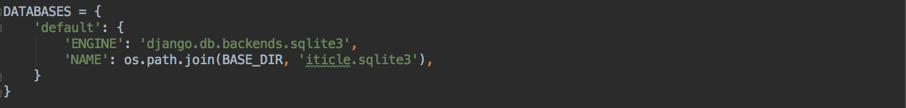

  Django支持主流的数据库，以Mysql为例，在settings中修改数据库相关设置

  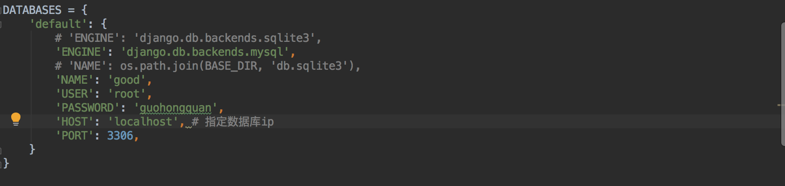

  <span style='color:red;font-weight:bold'>注意：指定的数据库，必须事先创建完成</span>

  ENGINE：数据库类型

  NAME：数据库名字

  USER：用户名

  PASSWORD：密码

  HOST：指定数据库ip

  PORT：数据库端口
  
* 设置数据库驱动，在工程的init.py中指定mysql驱动

  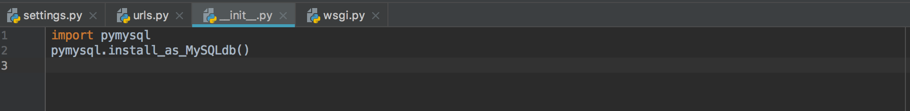

* 注意：当切换数据库后，可能数据没有对应的表，这时访问admin报错，只需要执行

  ```python
  python3 manage.py makemigrations
  python3 manage.py migrate
  ```

  后，数据库会自动生成相关表。

  ~~没有验证~~

* 重定向，在Django中重定向可以通过HttpResponseRedict实现，或者利用其封装函数redirect实现

  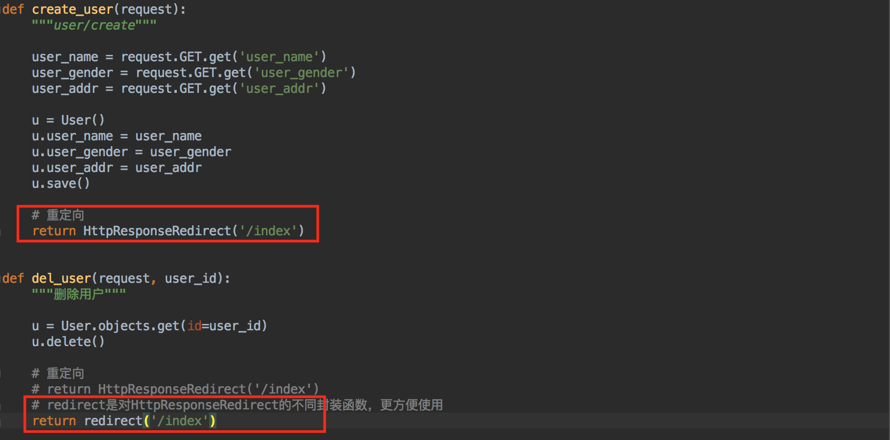

* 关于路由规则需要注意，在跳转时，href='/create' 跟 href='create'的区别

  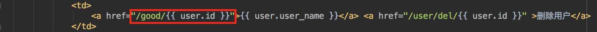

  第一个'/'，代表根目录，以localhost为例，'/create'即127.0.0.1:8000/create

  当从**<span style='color:red'>127.0.0.1:8000/index/</span>**跳转时：

  href='/create' -> ***127.0.0.1:8000/create***

  href='create' -> ***127.0.0.1:8000/index/create***

  **<span style='color:red'>故：在跳转路径中统一以'/'开头，避免路径错误</span>**


# 模型类查询数据

* mysql日志

  


## pip 命令

 * pip列表

   ```sh
   pip list
   ```

* pip搜索包

  ```sh
  pip search django
  ```

* pip添加的包及其版本

  ```sh
  pip freeze
  ```

* pip安装包

  ```sh
  pip install django
  ```

  注意：在虚拟环境中安装包，不要使用sudo，否则的话包将会安装在真实python环境中。

  ```sh
  pip install django==2.2
  ```

  注：安装时可以指定安装包的版本
  
  ```sh
  import django
  django.get_version()
  >>> '2.2.0'
  ```
  
* 查看pip安装的第三方库中可更新的库

  ```python
  pip3 list --outdated
  ```

* 查看pip安装的第三方库的位置

  ```python
  pip3 show django
  ```

  