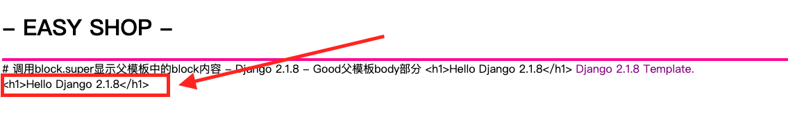
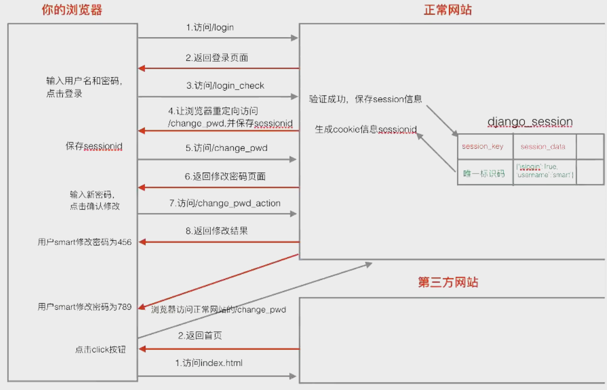
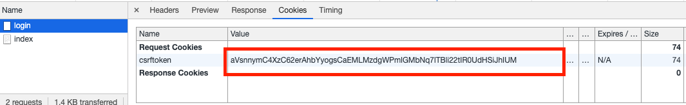
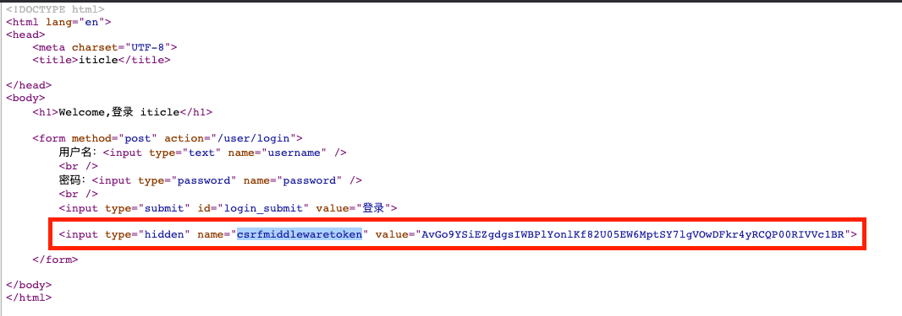

<div style="width:100%;height:30px;"><div style='float:right;'>- 2019.06.Django -</div></div>
<div style="float:left;width:12.5%;height:4px;background:deeppink;"></div>
<div style="float:left;width:12.5%;height:4px;background:fuchsia;"></div>
<div style="float:left;width:12.5%;height:4px;background:maroon;"></div>
<div style="float:left;width:12.5%;height:4px;background:navy;"></div>
<div style="float:left;width:12.5%;height:4px;background:crimson;"></div>
<div style="float:left;width:12.5%;height:4px;background:darkcyan;"></div>
<div style="float:left;width:12.5%;height:4px;background:purple;"></div>
<div style="float:left;width:12.5%;height:4px;background:brown;"></div>

# Django_2.1.8_Template

> <span style='color:darkcyan'>Template文件加载顺序</span>

* Django会首先默认在项目的settings中配置的templates文件夹中查找

* 如果settings中配置的templates文件夹中没有找到，则会在INSTALLED_APPS下面的每个应用中查找，前提是应用中必须有templates文件夹

  >  以404页面为例，当在templates文件夹中创建了404.html，则Django查找404页面模板文件时，会首先在templates中查找（因为settings中配置了templates文件夹路径），如果在templates文件夹中找到了404模板，那么就不会再去查找Django默认的404模板文件了

> <span style='color:darkcyan'>Template组成</span>

* 模板由两部分组成
  * 静态文件：css, js, html
  * 动态内容：模板语言

> <span style='color:darkcyan'>模板语言</span>

* **模板变量**

  * 模板变量由数字，字母，下划线，和 点 组成，但不能以下划线开头

  * 使用格式：{{ obj.attr }}，**obj可以为字典，对象，列表等**，模板变量的解析有个顺序

    * obj为字典，attr作为字典的key进行取值，即obj[attr]
    * obj为对象，attr作为对象的属性进行取值，即obj.attr
    * obj为对象，attr作为对象的方法进行取值，即obj.attr

    也有使用格式为 {{ obj.0 }}

    * obj为字典，0为key，即obj[0]
    * obj为列表，0为下标，即obj[0]

    <span style='color:red'>**注意：如果模板变量解析失败，则生成模板时，会使用空字符串填充模板变量。**</span>

* **模板标签**

  * for循环

    ```python
    
    	# 需要执行的代码
      if {{ forloop.counter }} == 1:
        # 执行特殊代码
    
    	# 没有遍历到结果
    
    ```

    forloop.counter用来获取当前for循环的index

  * if条件

    ```python
    
    
    
    
    ```

    逻辑运算符 not and or

  [更多模板标签>>>官方文档](https://docs.djangoproject.com/zh-hans/2.2/ref/templates/builtins/#built-in-tag-reference)

* **模板过滤器**

  * 对模板变量进行操作

  * 格式：模板变量|过滤器:参数，内置过滤器，参考：[官方文档->内置过滤器](https://docs.djangoproject.com/zh-hans/2.2/ref/templates/builtins/#built-in-filter-reference)，常用内置过滤器：

    * date

      ```python
      create_date|date:'Y-m-d'
      >>>'2019-01-01'
      ```

    * length：对字符串和列表求长度

      ```python
      goods|length
      >>>5
      ```

    * default：给模板变量设置默认值，不设置默认为空字符串

      ```python
      {{ user_addr|default:'中国，上海' }}
      ```

  * <span style='color:deeppink'>**自定义过滤器**</span>

    * 在app目录中创建名为'templatetags'的python package（python包），**与models.py和views.py同级目录**，**文件夹名字固定**

    * 在templatetags中创建自定过滤器python文件

    *  导入django包

      ```python
      from django.template import Library
      ```

    * 创建Library类的对象

      ```python
      register = Library()
      ```

    * 定义过滤器函数

      ```python
      @register.filter
      def ext(content):
        """给一段文字添加后缀"""
        return content + '--2019--'
      ```

    * 使用自定义过滤器

      ```python
      blog.content|ext
      ```

    **注意：自定义过滤器只允许传递一个自定义参数，即自定义过滤器函数可以设置两个参数，第一个参数为默认需要处理的模板变量，第二个参数是自定义传递的参数**

    **注意：无论Django内置的过滤器还是自定义过滤器，在需要参数时，参数需要紧邻':'，冒号与参数之间不能有空格，否则报错**

* **模板注释**

  * 单行注释：

    ```python
    {# #}
    ```

  * 多行注释：

    ```python
    
    
    ```

    注意：Html的注释，在查看网页源代码时是可以看到注释内容的，但是模板注释，在查看网页源代码时是看不到注释内容的

> <span style='color:darkcyan'>模板继承</span>

* 对于通用的网站主题或者通用的内容，一般使用模板继承的方式保持统一。

* 模板继承使用：

  * 在templates中创建父类模板文件，例如good_base.html

  * 在子类模板中引用父类模板

    ```python
    
    ```

  * 为了给子模板预留填充内容的入口，一般需要在父模板中预留block块，block块由‘block’ 和 block名字组成，子类可以重写该block块，以显示自定义内容。**如果想在子模板中显示除父模板以外的其他内容，则父模板必须预留block块。**

    **父模板**

    ```python
    
    	{{ content }}
    
    ```

    结束block块的模板语言也可以使用

    ```python
    
    ```

    但当多个block块嵌套时，为了增加代码的可读性，一般在endblock的时候使用block名字结束block块

    **子模板**

    ```python
    
        <span style="color:purple"> Django 2.1.8 Template. </span>
    
    ```

    如果在自模板中需要显示或者调用父模板的内容，可以通过super来实现

    ```python
    {{ block.super }}
    ```

    模板标题等也可以通过block块预留修改入口，比如：

    ```python
    <title>父模板</title>
    ```

> <span style='color:darkcyan'>Html转义</span>

* 当传递的参数中包含以下内容时，需要转义

  * \> : &gt
  * < : &lt
  * ' : &#39
  * ": &quot
  * &: &amp

  例如当函数给模板传递的参数内容为

  ```python
  {'content': '<h1>Hello Django 2.1.8</h1>'}
  ```

  则显示为

  

  查看网页源代码

  ```python
  &lt;h1&gt;Hello Django 2.1.8&lt;/h1&gt;
  ```

* 关闭模板上下文字符串转义，可以使用

  ```python
  {{ 模板变量|safe }}
  ```

  或

  ```python
  
  	{{ content }}
  
  ```

  区别：safe需要对每一个模板变量进行操作，而autoescape可以对在autoescape和endautoescape之间的所有模板变量进行操作，同时，如果需要对模板变量进行转义时，autoescape还可以通过on开启对模板变量的转义：

  ```python 
  
  	# 需要转义的操作
  
  ```

  <span style='color:red'>**注意：对于模板中硬编码的字符串默认不会经过转义**</span>（这里说的是**在模板中硬编码的字符串**），例如

  ```python
  {{ temp_variable|default:'<h1>Hello</h1>' }}
  >>>Hello
  # 如果一定想输出例如'<h1>Hello</h1>'样式的字符串，则可以使用特殊字符
  {{ temp_variable|default:'&lth1&gtHello&lt/h1&gt' }}
  ```

> <span style='color:darkcyan'>装饰器在处理登录状态中的应用</span>

* 对于一些需要登录后才能进入的页面或者接口，需要在正常接口调用前，对其进行是否登录的验证，在Python中通过**装饰器**来实现。

  * 定义一个装饰器

    ```python
    def login_require(fun):
        def wapper(request, *args, **kwargs):
            if request.session.has_key('islogin'):
                return fun(request, *args, **kwargs)
            else:
                if 'username' in request.COOKIES:
                    user_name = request.COOKIES['username']
                    return render(request, 'login/login_ajax.html', {'username': user_name})
                else:
                    return render(request, 'login/login_ajax.html')
        return wapper
    ```

  * 在需要进行登录验证的接口中使用装饰器对函数进行装饰

    ```python
    # 修改密码
    @login_require
    def mod_user_password(request):
        return HttpResponse('修改密码成功')
    ```

    这样在调用相关接口时，就会自动进行是否登录的验证，这是装饰器应用的一个很好的例子。

> <span style='color:darkcyan'>csrf攻击（跨站请求伪造）</span>

* 跨站请求伪造，当用户打开一个网站之后，浏览器保存了用户的登录sessionid，并且用户没有退出网站，

  如果在此期间用户又访问了其他用来跨站请求伪造的第三方网站，并且点击了页面上伪造的功能按钮，那么第三方网站就可以冒用正常网站的url地址，并利用浏览器可以获取到对应的cookie的能力，伪造用户请求。



* Django中利用一个csrf中间件```'django.middleware.csrf.CsrfViewMiddleware'```，默认启用了csrf保护。Diango中的csrf防护在settings中的MIDDLEWARE中。

* ~~csrf防护只针对post提交~~更严格的讲应该是除GET，HEAD，OPTIONS或TRACE之外的其他请求都应该使用csrf认证，所以在post提交中，要使用csrf_token标签开启csrf防护，

  * **模板中的表单post提交**

    ```python
    
    ```

  * **ajax中的post提交：在发起ajax请求前设置csrfmiddlewaretoken**

    ```python
    $.ajaxSetup({
    		data: {'csrfmiddlewaretoken': '{{ csrf_token }}'},
    })
    ```

* csrf防御原理：

  * 在第一次请求到来时，服务端会随机生成一个token，并将此token放在cookie中，此后每次Post请求，浏览器都会带上这个token，这个csrftoken只有在每次登陆的时候才会刷新

    

  * 在模板中添加了``````后，模板在渲染时会自动生成一个名字叫做```csrfmiddlewaretoken```的隐藏域，可通过查看网页源代码看到，这个token每次刷新页面都会变

    

  * token由两部分组成，salt(前32位)+token加密后的值(token_secret)，salt可以解出唯一的token_secret
  * 在验证时，保存在cookie中的csrftoken和模板隐藏域中的csrfmiddlewaretoken能解出相同的token_secret，那么验证通过允许提交数据，否则验证失败报403错误(禁止访问)。

  [详情参考>>>django中csrf token验证原理](https://www.cnblogs.com/saolv/p/10995646.html)

> <span style='color:darkcyan'>登录验证码</span>

* python中有个图片处理的库pillow

  ```python
  pip3 install pillow
  ```

  ```python
  def verify_code(request):
      """验证码"""
      # 导入随机函数模块
      import random
      # 定义画面的背景色，以及宽高
      bgcolor = (random.randrange(20, 200), random.randrange(20, 200), 255)
      width = 200
      height = 50
      # 创建画布
      img = Image.new('RGB', (width, height), bgcolor)
      # 创建画笔
      draw = ImageDraw.Draw(img)
      # 绘制噪点
      for i in range(0, 200):
          location = (random.randrange(0, width), random.randrange(0, height))
          fill = (random.randrange(0, 255), random.randrange(0, 255), random.randrange(0, 255))
          draw.point(location, fill=fill)
      # 定义验证码的备选值
      values = 'ABCD1234EFGH5678IJKLMN90OPQRSTUVWXYZ'
      # 随机选取4位作为验证码
      code = ''
      for i in range(0, 4):
          code += values[random.randrange(0, len(values))]
      # 构造字体对象
      font = ImageFont.truetype('/Library/Fonts/Chalkduster.ttf', 24)
      # 构造字体颜色
      font_color = (random.randrange(0, 255), random.randrange(0, 255), random.randrange(0, 255))
      # 绘制验证码
      draw.text((10, 10), code[0], font=font, fill=font_color)
      draw.text((60, 10), code[1], font=font, fill=font_color)
      draw.text((110, 10), code[2], font=font, fill=font_color)
      draw.text((160, 10), code[3], font=font, fill=font_color)
      # 释放画笔
      del draw
      # 将code存进session,用于验证时使用
      request.session['verifycode'] = code
      # 操作内存文件
      buf = BytesIO()
      # 将图片保存在内存中，类型png
      img.save(buf, 'png')
      # 将内存闹钟的图片数据返回给客户端，MIME类型为image/png
      return HttpResponse(buf.getvalue(), 'image/png')
  ```

* 验证码一般用来防止暴力请求，或者屏蔽机器人操作

* Django中验证码验证原理，生成的验证码后，服务器需要在session中保存一份，用来做验证，当用户提交表单时需要带上输入的验证码，如果二者一样，则验证通过，否则验证失败

> <span style='color:darkcyan'>url反向解析</span>

* 为了防止view中的函数名发生改变时，需要修改全部硬编码的url地址，一般我们会使用动态地址解析的方式，Django中使用reverse函数用来动态获取url地址

  ```python
  from django.urls import reverse
  ```

* <span style='color:purple'>**在模板中使用动态地址解析**</span>

  * 在project的urls.py中，引入app的urls.py的include函数中，设置参数```namespace```，namespace的值一般为app名字

    ```
    url(r'^', include('iticle.urls', namespace='iticle'))
    ```

  * 设置app的app_name，在app的urls.py中设置(urlpatterns外部进行设置)

    ```python
    app_name = 'iticle'
    ```

  * 给路由中的每一个地址添加一个name

    ```python
    url(r'^blog$', views.blog, name='blog')
    ```

  * 在页面跳转中使用name跳转，格式：```namespace:name```

    ```python
    <a href="">iticle blog</a>
    ```

    **通过动态解析地址的方式，可以获取地址的最新路由设置，可以动态修改路由而不影响已有跳转**

* 带位置参数的url(url with args)

  ```python
  <a href="">url_args</a>
  ```

* 带关键字参数的url(url with kwargs)

  ```python
  <a href="">url_kwargs</a>
  ```

* <span style='color:purple'>**在views中使用动态地址解析**</span>

  ```python
  # 无参数路由解析
  return redirect(reverse('iticle:blog'))
  ```

  ```python
  # 带位置参数路由解析
  return redirect(reverse('iticle:url_args', args=(1, 2)))
  ```

  ```python
  # 带关键字参数路由解析
  return redirect(reverse('iticle:url_kwargs', kwargs={'c': 3, 'd': 4}))
  ```

  **注意：在views中使用动态地址解析，需要导入reverse，Django2版本需要从django.urls中导入**

  注释：动态解析是对模板中或者视图路由部分进行操作

  


> <span style='color:fuchsia'>fuchsia</span>
>
> <span style='color:maroon'>maroon</span>
>
> <span style='color:navy'>navy</span>
>
> <span style='color:crimson'>crimson</span>
>
> <span style='color:deeppink'>deeppink</span>
>
> <span style='color:darkcyan'>darkcyan</span>

<div style="width:100%;height:30px;"><div style='float:right;'>- 2019.06.Django -</div></div>
<div style="float:left;width:12.5%;height:4px;background:deeppink;"></div>
<div style="float:left;width:12.5%;height:4px;background:fuchsia;"></div>
<div style="float:left;width:12.5%;height:4px;background:maroon;"></div>
<div style="float:left;width:12.5%;height:4px;background:navy;"></div>
<div style="float:left;width:12.5%;height:4px;background:crimson;"></div>
<div style="float:left;width:12.5%;height:4px;background:darkcyan;"></div>
<div style="float:left;width:12.5%;height:4px;background:purple;"></div>
<div style="float:left;width:12.5%;height:4px;background:brown;"></div>