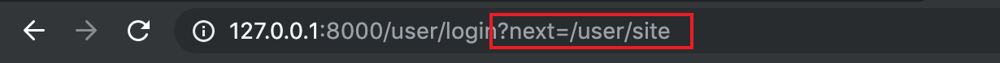
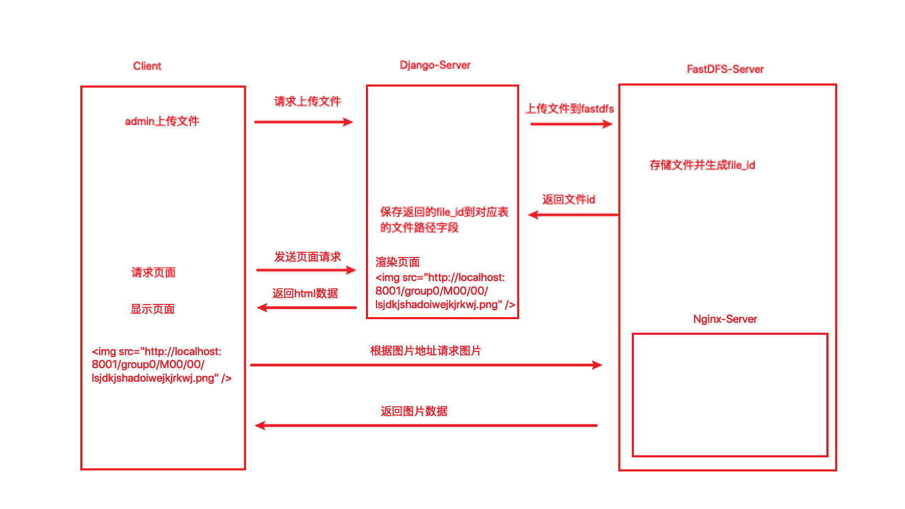

## Django TTSX实战

####登录及用户验证

* 使用Django认证系统进行用户验证

  导入用户认证系统使用的函数

  ```python
  from django.contrib.auth import authenticate, login
  ```

  * 在登录操作用一般要对用户名密码进行校验，Django认证系统中内置了一个验证方法

    ```python
    user = authenticate(username, password)
    ```

    如果通过username和password校验成功，则返回一个User实例，否则返回None

  * 对用户是否激活状态进行验证，可以直接通过is_active属性进行验证

    ```python
    if user.is_active:
      # 用户已激活
    else:
      # 用户暂未激活
    ```

  * 用户登录，对于校验用户名密码成功并且已经激活的用户使用Django内置登录函数进行登录

    ```python
    login(request, user)
    ```

  * 用户的基本验证流程

    ```python
    username = request.POST.get('username')
    password = request.POST.get('pwd')
    user = authenticate(username, password)
    if user is not None:
      if user.is_active:
        # 用户已激活
        # 用户登录
        login(request, user)
        # 处理其他逻辑。。。
      else：
      	# 用户暂未激活
    else:
    	# 用户验证失败  
    ```

    <span style='color:red'>注意：Django2之后的版本，对于is_active为False的用户，直接通过上述方式验证user 的结果为None，而不走is_active的判断逻辑，需要在settings中添加允许对未激活用户验证</span>

    ```python
    AUTHENTICATION_BACKENDS = ['django.contrib.auth.backends.AllowAllUsersModelBackend']
    ```

    原因：对于非激活用户其is_active属性为False,ModelBackend 和 RemoteUserBackend认证后端会禁止此类用户认证，如果自定义的用户模型没有is_active属性，则允许进行认证。可以在配置中使用AllowAllUsersModelBackend或者AllowAllUsersRemoteUserBackend允许非激活用户进行认证

* 页面跳转验证登录状态

  对于需要用户登录后才能访问的页面，在跳转到页面之前需要对用户是否已经登录做验证，如果已经登录则至直接跳转到对应的页面，**否则跳转到用户登录页面，登录之后再重定向到目标页面**

  * 方式一：直接通过login_required装饰器验证用户是否登录

    导入用户登录验证函数

    ```python
    from django.contrib.auth.decorators import login_required
    ```

    login_required()装饰器装饰后，当用户访问页面需要登录时，如果用户没有登录，login_required会重定向到settings.LOGIN_URL，并且会把用户要访问的页面路径作为next参数的值带进url```/accounts/login/?next=/user/order```

    如果用户已经登录，则访问时会直接跳转到要访问的页面

    settings.LOGIN_URL如果不设置，则默认```/accounts/login/```

    ```python
    # 配置默认登录URL配置
    LOGIN_URL = '/user/login'
    ```

    login_url的设置还可以直接通过装饰器参数指定

    ```python
    @login_required(login_url='/user/login')
    ```

    next作为目标跳转页面的默认参数名，允许用户使用自定义参数名，方式如下：

    ```python
    @login_required(redirect_field_name='next_page')
    ```

    在登录视图（或登录函数）中需要对next进行处理，才能在用户登录后访问目标页面

    ```python
    redirect_page = request.GET.get('next', reverse('goods:index'))
    response = redirect(redirect_page)
    ```

    注意：登录参数要通过POST获取，但next的值需要通过GET获取，get可以指定默认值，如果目标页面不存在时则直接跳到默认页面

    <span style='color:red'>注意：未登录用户访问需要登录页面时，目标页面参数next=/user/order会直接拼在url后面，在form提交中要注意不需要指定action,没有指定action的时候form提交会直接提交到当前路径中，即http://127.0.0.1:8000/user/login?next=/user/site提交后才能获取到next</span>

    

    * 使用login_required装饰器装饰**视图函数**

      ```python
      @login_requered
      def login(request):
        """用户登录"""
      ```

    * 使用login_requeired装饰**自定义View类**，在路由中进行装饰

      ```python
      url(r'^login$', login_required(UserCenterLoginView.as_view()), name='login')
      ```

  * 方式二：通过让视图类继承LoginRequiredMixin进行验证

    导入LoginRequiredMixin

    ```python
    from django.contrib.auth.mixins import LoginRequiredMixin
    ```

    在定义View类时继承LoginRequiredMixin

    ```python
    class UserCenterInfoView(LoginRequiredMixin, View):
        """用户中心-个人信息视图"""
        def get(self, request):
            """个人信息页面"""
            return render(request, 'user/user_center_info.html', {'active': 'user'})
    ```

* 判断用户登录状态

  在Django中会使用中间件拦截request对象到认证系统中，认证系统会给request添加一个user属性，代表当前用户，如果用户登录了，则user就是User的实例，否则就是AnonymousUser的实例，所以可以通过user的is_authenticated()来做判断

  ```python
  if request.user.is_authenticated():
    # 用户已经登录
  else:
    # 用户没有登录
  ```

  如果需要在模板中使用request.user，可以直接通过Django框架获取，因为除了自己往模板变量中传递的参数之外，Django也会把一些默认参数传递到模板文件。注意Django传到默认文件的 参数名为user

  ```django
  
    <div class="login_info fl">
      欢迎您：<em>{{ user.username }}</em>
      <span>|</span>
      <a href="">退出登录</a>
    </div>
  
    <div class="login_btn fl">
      <a href="">登录</a>
      <span>|</span>
      <a href="">注册</a>
    </div>
  
  ```

  注意，在模板中使用反向解析，``````

* 用户退出

  Django认证系统内置了用户退出的方法，删除用户登录session

  ```python
  from django.contrib.auth import authenticate, login, logout
  ```

  ```python
  class UserLogoutView(View):
      """用户退出登录"""
      def get(self, request):
          """退出登录"""
          # 清除用户session信息
          logout(request)
  
          # 跳转到首页
          return redirect(reverse('goods:index'))
  ```

#### django-redis缓存

* 浏览记录存储

  对于浏览记录，在浏览内容过程中需要频繁的操作传统数据库，浏览记录表压力较大，一般此类问题采用内存数据库解决

  [具体使用，参考【Redis.md】]

#### FastDFS存储图片或者文件



* 自定义django上传文件

  [Django自定义文件存储](https://docs.djangoproject.com/zh-hans/2.2/howto/custom-file-storage/)

  * 自定义存储类需要继承``` `Django.core.files.storage.Storage` ```

  * Django实例化自定义存储系统时，不能带参数，所以所有的参数都需要在settings中设置

  * 添加client.conf文件到工程中，因为Fdfs_client实例化时需要配置文件，并修改client.conf

    > base_path=/Users/guohongquan/fastdfs/tracker # 注意该路径必须真实存在
    >
    > tracker_server=172.18.0.2:22122 # tracker_server的host:port

  * 自定义存储类

    导入支持包```from fdfs_client.client import Fdfs_client```

    重写方法

    ```python
    from django.core.files.storage import Storage
    from django.conf import settings
    
    from fdfs_client.client import get_tracker_conf, Fdfs_client
    
    
    class FDFSStorage(Storage):
        """自定义fastdfs存储类"""
        def __init__(self):
            """初始化，无参数"""
    
        def _open(self, name, mode='rb'):
            """打开文件的方法"""
            # 方法原型：_open(name, mode='rb')
            pass
    
        def _save(self, name, content):
            """保存文件的方法"""
            # 方法原型：_save(name, content)
            # name 上传文件的名字
            # content File类的对象，包含上传文件内容
    
            # 创建Fdfs_client对象
            conf_obj = get_tracker_conf(settings.FDFS_CLIENT_CONF)
            fdfs_client = Fdfs_client(conf_obj)
            # 上传文件到FastDFS
            res = fdfs_client.upload_by_buffer(content.read())
    
            # res返回结果数据结构
            # dict
            # {
            #     'Group name': group_name,
            #     'Remote file_id': remote_file_id,
            #     'Status': 'Upload successed.',
            #     'Local file name': '',
            #     'Uploaded size': upload_size,
            #     'Storage IP': storage_ip
            # }
    
            if res.get('Status') != 'Upload successed.':
                # 上传失败
                raise Exception('Upload Faild')
    
            # 获取fild_id
            file_id = res.get('Remote file_id')
    
            return file_id
    
        def exists(self, name):
            """判断文件名是否可用"""
            return False
    
        def url(self, name):
            """返回访问文件的url"""
            return settings.FDFS_URL + name
    ```

  * 在settings中自定义文件存储配置，FastDFS配置, 默认django.core.files.storage.FileSystemStorage

    ```python
    # 自定义文件存储配置，FastDFS配置, 默认django.core.files.storage.FileSystemStorage
    DEFAULT_FILE_STORAGE = 'utils.fdfs.storage.FDFSStorage'
    # 设置fdfs使用的client.conf的文件路径
    FDFS_CLIENT_CONF='./utils/fdfs/client.conf'
    # 设置fdfs存储服务器上nginx的IP和端口号
    FDFS_URL='http://localhost:8001/'
    ```

  * 调用方式

    ```html
    
    ```

    good.image会返回FastDFS存储的文件id，即```group1/M00/00/00/rBIAAl1BJeSATJFnAAAEhqMbm9I868.png```格式的file_id

    这里的url会直接调用上面的url方法，在url方法里面返回了完整的图片路径


####页面静态化

静态化目的：对于首页这种网站入口，大概率被用户访问的页面，即80%用户会访问的20%页面中的一个，如果对所有用户展示内容相同，那么每次通过调用接口，查询数据库，然后渲染页面到客户端，就会造成体验不佳，所以对此类页面需要做页面静态化，即内容预加载。（访问内容预加载的静态化页面，跳过了数据查询过程，直接渲染静态页面，能提升用户体验）

页面重新生成：当首页页面数据发生变化或者修改后，需要重新生成页面，需要一个闭环的页面更新逻辑

页面静态化，需要在第一次查询数据，生成页面后将页面内容写到文件中，再次访问时，作为静态页面直接渲染。由于需要写文件，所以使用Celery做异步任务处理。


