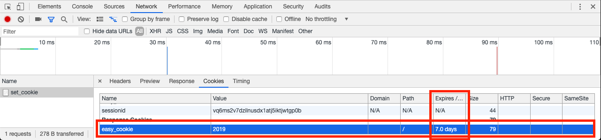

# Django_2.1.8_View

> <span style='color:deeppink'>view介绍</span>

* Django中View相当于MVC中的C，用来处理数据和逻辑
* Django中的WSGI服务，在DEBUG模式时，会在404页面中输出调试信息，在生产环境中我们可以自定义404页面
  * 404:遇到无法找到页面或者url配置出错时，会报404
  * 在templates中创建一个H5页面404.html,则Django会自动去调用自定义的404页面，在自定义404页面中可以调用参数request/request_path等,用来显示路径等。


​			500:当代码报错时会报500，根据提示去代码中修改

* 调试，Django切换Debug和生产环境
  * DEBUG=False
  * ALLOWED_HOST=['*']

> <span style='color:deeppink'>捕获url参数</span>

* 位置参数

  参数名可以随意指定，?a=1&b=2&c=3…..

* 关键字参数

  关键字参数，视图中的参数名必须和正则表达式组名一致

  ?P<组名>

  ```python
  url(r'^input/(?P<name>.*)', views.inputs)
  ```

  ```python
  def inputs(request, name):
      return HttpResponse(name)
  ```

> <span style='color:deeppink'>登录操作</span>

* 中间件验证导致的报错


​	这种情况下，用于DEBUG模式可以关闭中间件验证，在settings中注释掉MIDDLEWARE中的

```python
'django.middleware.csrf.CsrfViewMiddleware',
```

> <span style='color:deeppink'>HttpRequest</span>

* Django中的网络请求的request.Post和request.Get数据类型都是QueryDict

  ```python
  <class 'django.http.request.QueryDict'>
  ```

* QueryDict与Dict的区别，QueryDict允许同一个key对应多个value

  > 当QueryDict一个key对应多个value的时候，不同的取值方法对应不同的结果

  ```django
  >>> from django.http.request import QueryDict
  >>> q = QueryDict('a=1&a=2&a=3&b=4')
  >>> q['a']
  >>> 3
  >>> q.get('a')
  >>> 3
  >>> q.getlist('a')
  >>> ['1', '2', '3']
  ```

* request中的属性
  * path：页面请求的完整路径，不包含域名和参数部分
  * method：请求使用的HTTP方法，包括GET/POST
  * encoding：提交数据的编码格式，一般为utf-8，可读写
  * GET：QueryDict对象，包含了get请求的所有参数
  * POST：QueryDict对象，包含了post请求的所有参数
  * FILES：包含上传的所有文件
  * COOKIES：python中的字典对象，包含所有的cookie，键和值都为字符串
  * session：表示当前对话，启用Django回话支持时可用，可读写

> <span style='color:deeppink'>ajax</span>

* ajax：异步的javascript，**ajax的请求都在后台**

* 应用场景：在不重新加载页面的情况下，对页面进行局部刷新

* 格式：

  ```javascript
  $.ajax({
    'url': '请求地址',
    'type': '请求方式',
    'dataType': '预期返回的数据格式',
    'data': '参数',
    'async': 'true[同步ajax]/false[异步ajax]'
  }).success(function(data){
    // 回调函数
  })
  ```

* 使用ajax：
  
  * 在**工程根目录**中新建名为**static**的静态文件夹，用来存放项目的所有静态文件（包括css, js, image）
  
    
  
  * 在工程的settings中设置static文件夹的检索路径 
  
    ```django
    # 设置静态文件目录
    STATICFILES_DIRS = [os.path.join(BASE_DIR, 'static')]
    ```
  
  * 在project的settings中还有另外一个跟静态文件相关的配置
  
    ```python
    STATIC_URL = '/static/'
    ```
  
    这个配置用来设置访问静态文件对应的url，即在使用静态文件时路径```'/static/images/01.png'```
  
  * 在使用ajax的地方导入jquery
  
    ```javascript
    <script src="/static/js/jquery-1.12.4.min.js"></script>
    ```
  
  * 静态文件的查找
  
    Django会首先默认在project的settings中配置的静态文件路径STATICFILES_DIRS中查找，如果能找到对应的资源，则使用，否则会到app所在目录的static文件夹中查找，前提是app所在目录中要存在static文件夹。关于查找顺序，可以通过```print(settings.STATICFILES_FINDERS)```进行查看。
    
    
    
  * ajax使用示例
  
    ```javascript
    <script>
            $(function () {
                // 绑定按钮的click事件
                $('#login_submit').click(function () {
                    // 获取用户名和密码
                    username = $('#username').val()
                    password = $('#password').val()
                    // 发起ajax请求
                    $.ajax({
                        'url': '/user/login_ajax_handle',
                        'type': 'post',
                        'dataType': 'json',
                        'data': {'username': username, 'password': password}
                    }).success(function (data) {
                        // 处理
                        if (data.res == 0) {
                            $('#user_name_input').show().html('用户名或者密码错误，请重新输入')
                        } else {
                            $('#user_name_input').hide()
                            // 跳转到首页
                            location.href = '/index'
                        }
                    })
                })
            })
    </script>
    ```
  
    ```html
    <input type="button" id="login_submit" value="登录" />
    ```

> <span style='color:deeppink'>cookie</span>

* 由于http是无状态的，在web开发中有时需要记录用户状态，比如登录状态等，cookie和session由浏览器提供用来存储程序状态。cookie是由服务端生成，保存在客户端(浏览器)的文本信息。

* 浏览器访问一个网站时，会将浏览器存储的跟这个网站相关的所有cookie信息发送给该网站的服务器

* cookie是域名安全的

* 设置cookie，设置cookie时，需要一个HttpResponse实例对象或者其子类(HttpResponseRedirect, JesonResponse)对象,

  ```python
  # 设置cookie
  def set_cookie(request):
      """设置cookie"""
      response = HttpResponse('ok')
      response.set_cookie('easy_cookie', '2019')
      return response
  ```

  当通过浏览器访问设置cookie：http://127.0.0.1:8000/set_cookie，在Request Headers中可以查看到cookie设置的值

  

* 读取cookie

  ```python
  # 获取cookie
  def get_cookie(request):
      """获取cookie"""
      # 读取cookie的内容
      easy_cookie = request.COOKIES['easy_cookie']
      return HttpResponse(easy_cookie)
  ```

  当通过浏览器访问http://127.0.0.1:8000/get_cookie时会显示之前设置的cookie值， 但是如果不设置cookie的过期时间，重启浏览器后就无法读取到之前保存的cookie值

* 设置cookie的有效期

  ```python
  # 设置有效期方式一：设置max_age
  response.set_cookie('easy_cookie', '2019', max_age=7*24*60*60)
  # 设置有效期方式二：设置expires
  response.set_cookie('easy_cookie', '2019', expires=datetime.now()+timedelta(days=7))
  ```

  再次访问http://127.0.0.1:8000/set_cookie，在cookie中可以看到，新设置的cookie有了过期时间

  

> <span style='color:deeppink'>session</span>

* 与cookie保存在浏览器端不同的是，session保存在服务器端，在Django中session保存在django_session中，对应数据库中的django_session表
* session也是通过键值对存储的，session通过request.session读取和设置
* session是依赖于cookie的，唯一标识码sessionid保存在cookie中
* session也可以设置过期时间，如果不指定，默认两周过期


* 注意django_session表中存储的session信息中，session_data中的数据是base64编码后的数据

* session相关方法

  * 获取session

    ```python
    request.session.get('user_name')
    request.session['user_name']
    ```

  * clear

    ```python
    # 删除存储的session值的部分，session_data解码后包含两部分，一个默认的字符串key部分：{值部分}
    request.session.clear()
    ```

    清除前

    ```python
    413beb62041e68db6263c7f354a7bdcb8f59d06d:{"user_name":"iticle_session","user_gender":1}
    ```

    清除后

    ```python
    b1da7b493c018c1e30593c94bf088079cb4b10da:{}
    ```

  * flush

    ```python
    # flush意为删除整条session数据
    request.session.flush()
    ```

  * 删除指定键值对

    ```python
    del request.session['key']
    ```

  * 设置过期时间

    ```python
    request.session.set_expiry(value)
    ```

    value 整数 ，回话将会在value秒之后过期

    value 0， 当浏览器关闭时过期

    value none，默认2周过期

  * 读取过期时间

    ```python
    request.session.get_expiry_date()
    request.session.get_expiry_age()
    ```

* <u>**cookie 和 session 的区别和使用**</u>

  * cookie是存储在浏览器的，session是存储在服务器的
  * session生成的唯一标识符存储在cookie中

  * **cookie 适用安全性不高的应用场景，比如记住用户名等**
  * **session 适用涉及到安全性要求比较高的数据，比如用户账号、密码等**
